# T2A2 - Marketplace Project

A Ruby on Rails Project - created by: Wilson Esmundo

To view in Heroku <br/>
Please click [here](http://manspalhouse.herokuapp.com/) <br/>
Url : http://manspalhouse.herokuapp.com/ <br/>

Github Repository <br/>
Please click [here](https://github.com/charliegucci/marketplace) <br/>
Url : https://github.com/charliegucci/marketplace <br/>

<hr>

## Table of Contents

- [Description of the project](#description-of-the-project)
  - [Problem definition and purpose](#problem-definition-and-purpose)
  - [Functionality and features](#functionality-and-features)
  - [Sitemap](#sitemap)
  - [Screenshots](#screenshots)
  - [Target audience](#target-audience)
  - [Tech stack](#tech-stack)
- [User Stories](#user-stories)
- [Wireframes](#wireframes)
- [ERD](#erd)
- [High-level components](#high-level-components)
- [Third party services](#third-party-services)
- [Active record associations](#active-record-associations)
- [Database relations and Database schema](#database-relations-and-database-schema)
- [Ways task were allocated and tracked](#ways-task-were-allocated-and-tracked)

## Description of the Project

This project is a two way marketplace app for dog lovers where dog breeders can advertising puppies being sold and Buyers will see dog listings and and be able to communicate to the breeder.

### Problem definition and purpose

The application was created for the sole purpose of promoting the pure bred pedigree dog so you won't find any crossbred in this website. In the table below is a comparison between a pure bred pedigree dog vs cross breeds.<br/>
| Dog | Pure Bred Pedigree Dog | Cross Breeds |
| :------- | :------------------------: | :-------------- |
| |Both parents are of the same breed.| A Dog resulting from the deliberate mating of two unrelated breed types.|
|| The breed is recognised by the Australian National Kennel Council (ANKC) or one of its Affiliates.| A Dog resulting from an accidental or unintentional mating of two different breed types.|
|| The dog's breeders are registered to breed puppies.| A Dog resulting from the mating of one pedigree or pure bred parent and one cross bred or designer bred dog.|
|| The parents of any puppies are registered with the ANKC or one of its affiliates to be bred from | A Cross Breed dog has not been bred by a registered breeder|
|| It has a pedigree showing at least 3 generations of parentage |A Cross Breed dog is not pure bred or pedigree.| <br/>

Disadvantages of Cross breeds are the following: <br>

- difficulty in predicting temperament<br/>
- Hard to Predict Adult Size
- Potential for High Risk Deliveries
- Strong Chance for Congenital Health Issues
- May Be More Expensive Than a Purebred<br/>

According to Australian Companion Animal Council, Australia has one of the highest rates of dog ownership in the world, despite a small decline in recent years. About 2.8 million households have at least one dog. Figures on cross breed dogs are not centralised but research estimates sales of cross bred dogs surpassed pure bred pedigree.<br/>

Adding a dog to the family is a huge step because it involves 10 to 15 years of commitment and the final choice between a pedigree dog or a cross breed dog is up to you.<br/>

In this app, we aim to:<br/>

- assure buyers that they will have a good experience and confidence of all puppies being sold will adhere to the Australian National Kennel Council regulations.
- That dog breeders needs to be registered and approved by Australian National Kennel Council by proof of a valid breeder prefix Identification.

### Functionality and Features

- Create an account for users to be able to store information.
- Users who wants to advertise dogs needs to apply to become a seller by providing necessary information and uploading a valid Breeder id.
- Once approved, User will be notify thru email so they can proceed thru the next step which is payment of membership.
- Once payment is confirmed, user becomes a seller and will be notify with email so they can proceed in puting up listings.
- Otherwise if rejected, email will be sent to the user so they can re apply.
- All Users can browse all listings
- Be able to send custom email to sellers for the listings their interested in.
- All users can share a particular listing thru social media(eg. facebook and twitter)
- Admin User can create, edit, update and delete instance of all models (USERs, BREEDs, BUYER/MESSAGESs and LISTINGs )
- Admin users can edit attributes of Model fields(NAMES, EMAILS,PHONE etc)
  <br/>

### Sitemap

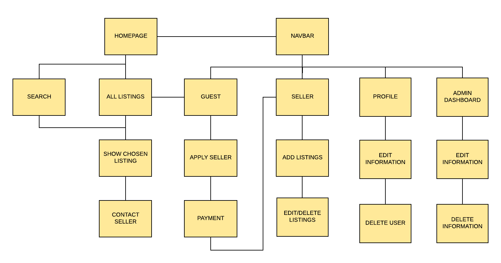 <br/>

### Screenshots

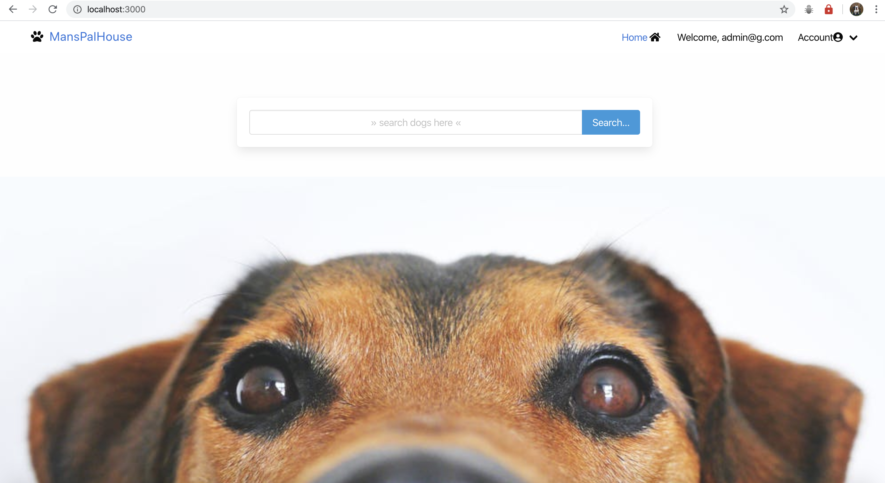 <br/>
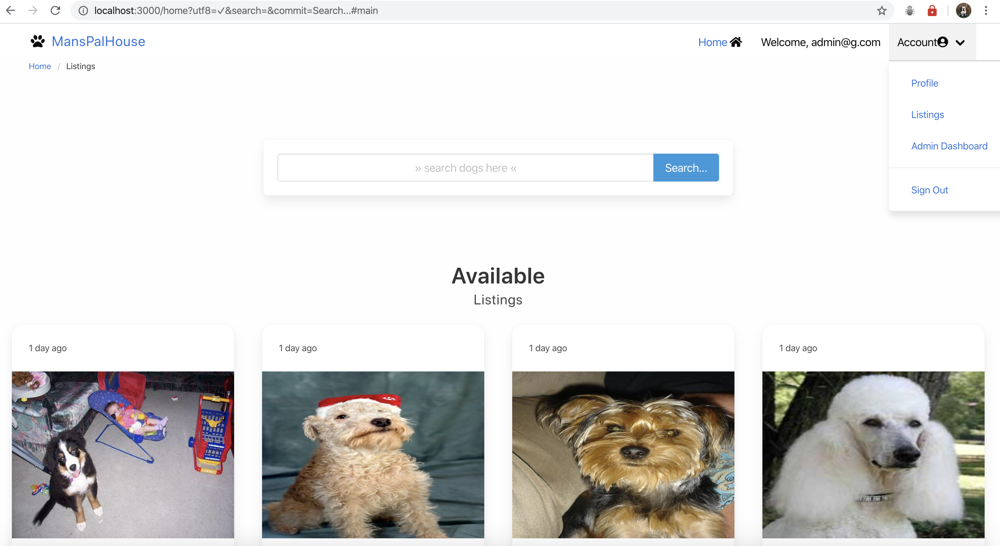 <br/>
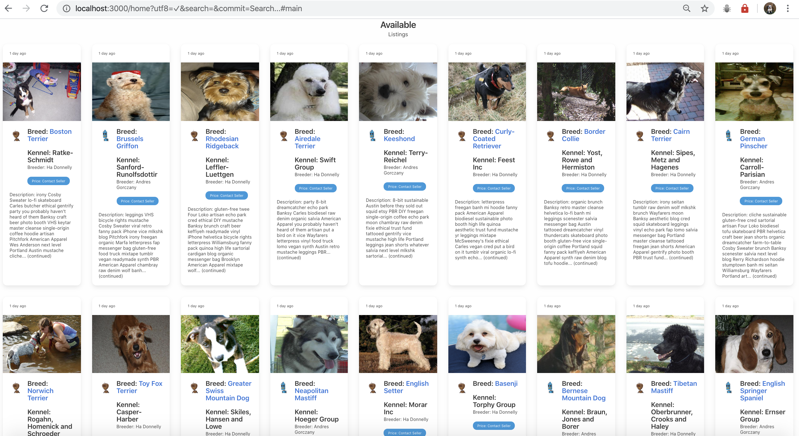 <br/>
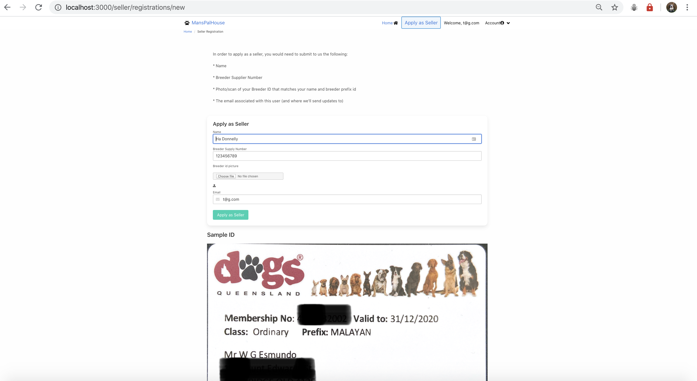 <br/>
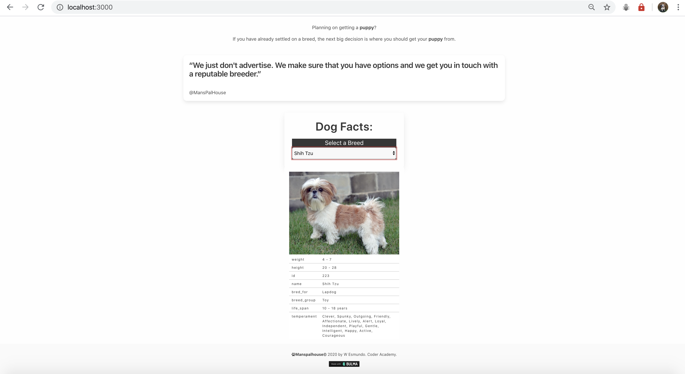 <br/>
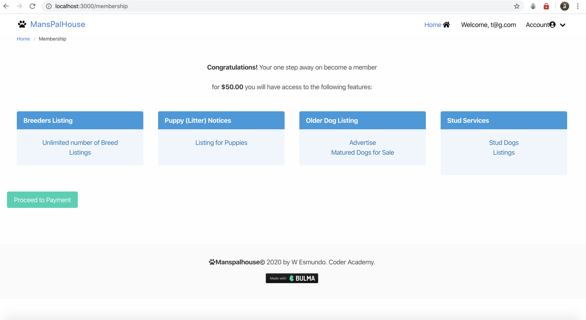 <br/>
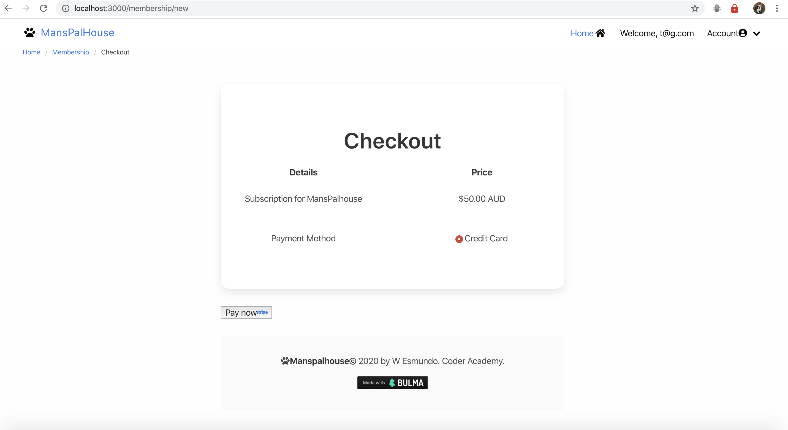 <br/>
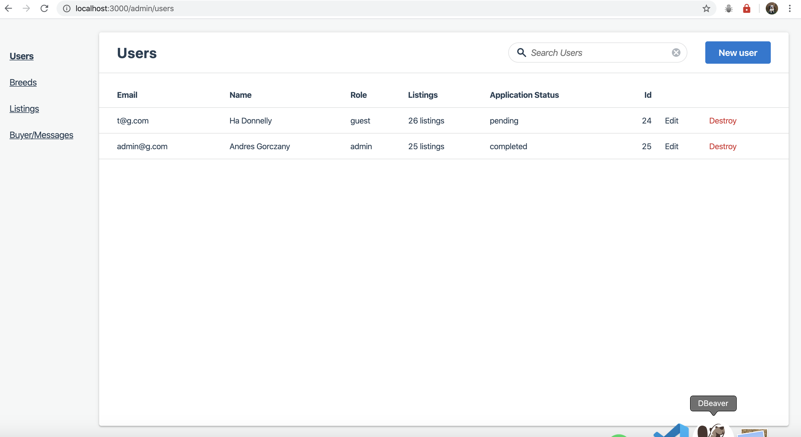 <br/>

### Target audience

This application aims to target those dog lovers who wants peace of mind when planning to add a pet in their family and also for Breeders who wants to showcase and promote pure breed dogs. <br/>

### Tech Stack

The following were used to develop my application:

- Ruby on Rails
- Bulma
- Heroku
- Stripe
- Amazon Web Service (S3)
- Gmail SMTP server
- Github
- Postgresql

## User Stories

The user stories I have created involves three key consumer roles: admin, buyer and seller. Admin refers to someone maintaining, monitoring and approving the application usage. Seller refers to a consumer that uses the application to advertise dogs online and buyer refers to someone who purchases the dogs listed by the seller.<br/>

#### As a Seller I want to be able to:

- make an account so my information can be associated with my actions.
- pay for the membership so I can advertise my listings in the app.
- alter my account so in case any future changes that will occur.
- remove my account so they will be no copy of information stored in the website.
- create a new listing so I can add dogs information for possible buyers to view.
- upload a picture of my dog listing so that buyer can visualize what im posting.
- edit my existing listings so I can change information if necessary.
- delete my existing listing so I can remove it once sold or if its no longer for sale.
- view every listings that i have so I can easily see in a glance all my advertisements.
- link my listing so that I can share it thru social media
  <br/>

#### As a Buyer I want to be able to:

- make an account so my information can be associated with my actions.
- alter my account so in case any future changes that will occur.
- remove my account so they will be no copy of information stored in the website.
- apply as a Seller in case I want to advertise dog as well.
- search a listing so I can quickly view all the dog breeds I want to buy.
- view all the available listing in a list so I can browse thru the advertisement.
- contact the seller thru email so I can make enquiries about the listing.
- share the listings online so I can pass the ads to other people thru the internet.
  <br/>

#### As an Admin I want to be able to:

- view all of the dogs for sale so I can easily identify any inappropriate listings.
- edit a listing so I can change the information, correct any errors or alter inappropriate content.
- delete a listing so I can remove a advertisements that is not appropriate for the application.
- search information about the users so that I can easily view the information I needed.
- approve application of a user to become a seller so that we can control fraud sellers.
- check if users already paid membership so we can start allowing them to post listings.
- send email to user once applications approved so that they can proceed to the next step.
- send email to user once payment is approved so that they can start listing advertisements.
- reject application so that users should be able to provide the correct document and information needed.

## Wireframes

### Desktop Version

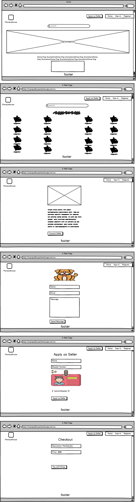 <br/>

### Tablet Version

 <br/>

### Mobile Version

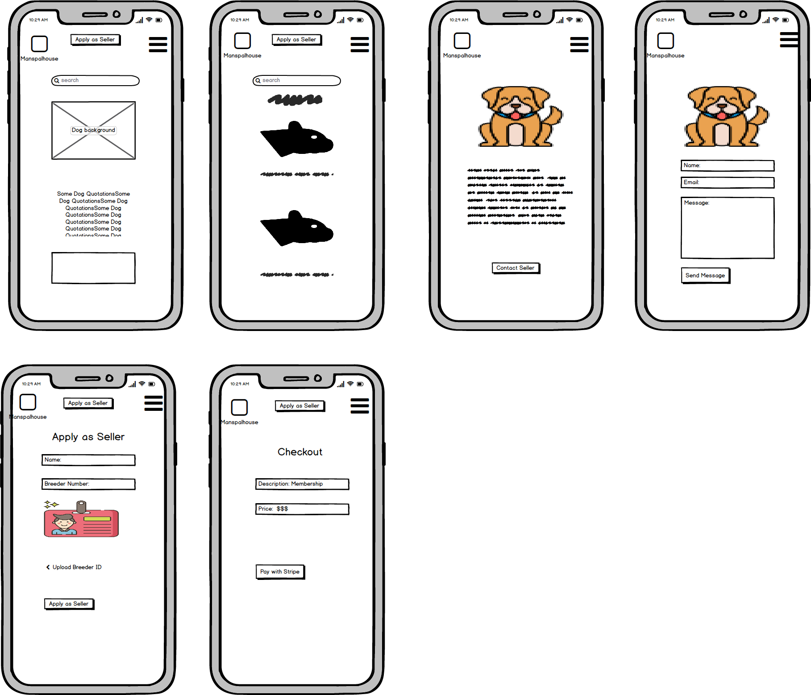 <br/>

## ERD

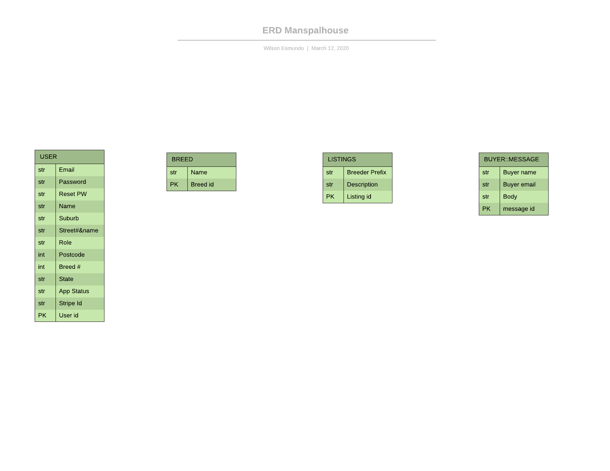 <br/>

## High-level components

This application compose of 4 models which are User, Breed, Listing and Message. The User model was generated by the Devise gem that handles the authentication of the application. We manage to edit the Users table by adding extra coloumns such as addresses, breeder id number , avatar etc that will associate with all the users. The User, Breed and Message models are associated with the Listing model basically users, breeds and messages can have many listings and that listing belongs to the user, breed and message. With the help of the Administrate gem, admin users can perform CRUD in all model instances and edit table and its corresponding columns. Hence, when a user applies to become a seller, admin just need to check the user table and verify its information. By using Active Record Callbacks, we are able to create a function that will send a email (Action Mailer) to users in every changes we do such as application status from pending to approved and other actions. Regarding membership payment, we use Stripe gem to help us process the payment transaction. By using webhooks will be able to tell if the payment goes thru and we store the payment id to the user table for reference. The Listing model which is controlled by its corresponding Listings controller is set to show all listing regardless if you have created an account or not. But will trigger an authentication if you choose to contact the seller will the help of Devise built in helpers such as 'before_action :authenticate_user!'. Once login, users can send custom email messages to the seller by the used of Action Mailer. Google SMTP server was set in the env/production.rb as the email provider.

## Third party services

The following third-party services were utilized in the development of this application:<br/>
| Third-Party Services | Description |
| :------- | :-------------- |
| Heroku | is a container-based cloud Platform as a Service (PaaS). Developers use Heroku to deploy, manage, and scale modern apps. Our platform is elegant, flexible, and easy to use, offering developers the simplest path to getting their apps to market. We used it to host the application for testing and deployment of our app. https://www.heroku.com/ |
| Github | is a Git repository hosting service, but it adds many of its own features. While Git is a command line tool, GitHub provides a Web-based graphical interface. It also provides access control and several collaboration features, such as a wikis and basic task management tools for every project. We used it for version control and project managment. https://github.com/
| AWS S3 | is a scalable, high-speed, web-based cloud storage service designed for online backup and archiving of data and applications on Amazon Web Services. Amazon S3 was designed with a minimal feature set and created to make web-scale computing easier for developers. We used it for file uploading. https://aws.amazon.com/s3/|
| Stripe | is a technology company that builds economic infrastructure for the internet. Businesses of every size—from new startups to public companies—use our software to accept payments and manage their businesses online. We used it to handle the payment. https://stripe.com/au |
| Gmail SMTP | a protocol for sending e-mail messages between servers. Most e-mail systems that send mail over the Internet use SMTP to send messages from one server to another. We used its setting for the Rails Active Mailer to be able to send emails. https://google.com|
| Fontawesome | Allows Font-Awesome web fonts and stylesheets to be used in the marketplace. https://fontawesome.com/|
<br/>
The following Ruby on Rails gems were also implemented in the application:

| Ruby Gems    | Description                                                                                                                                                                                                                                                                                                                          |
| :----------- | :----------------------------------------------------------------------------------------------------------------------------------------------------------------------------------------------------------------------------------------------------------------------------------------------------------------------------------- |
| Devise       | is a flexible authentication solution for Rails based on Warden. We used it for authentication. https://github.com/heartcombo/devise                                                                                                                                                                                                 |
| Pundit       | provides a set of helpers which guide you in leveraging regular Ruby classes and object oriented design patterns to build a simple, robust and scalable authorization system. We used it for the apps authorization. https://github.com/varvet/pundit                                                                                |
| Administrate | is a library for Rails apps that automatically generates admin dashboards. Its admin dashboards give non-technical users clean interfaces that allow them to create, edit, search, and delete records for any model in the application. We used it to create the apps admin dashboard. https://administrate-prototype.herokuapp.com/ |
| Pagy         | is the ultimate pagination gem that outperforms the others in each and every benchmark and comparison. We used it to create the apps pagination. https://github.com/ddnexus/pagy                                                                                                                                                     |
| Bulma        | is a free, open source CSS framework based on Flexbox and used by more than 200,000 developers. We used it to style the HTML layout. https://bulma.io/                                                                                                                                                                               |
| Pry          | An IRB alternative and runtime developer console. We used this as an debugging tool. https://rubygems.org/gems/pry                                                                                                                                                                                                                   |

## Active record associations

```ruby
class User < ApplicationRecord
  has_many :listings
  has_one_attached :breeder_id_picture
  has_one_attached :avatar
end
```

User Model has one to many relation with the Listing model, and one to one relation with the breeder id picture and avatar which are two separate blobs. Basically its saying that User has many listings, 1 breeder id picture and 1 avatar picture. <br/>

```ruby
class Listing < ApplicationRecord
  belongs_to :breed
  belongs_to :user
  has_one_attached :picture
  has_many :buyer_messages, class_name: "Buyer::Message"
end
```

Listing Model has many to one relation(belongs_to) with Breed and User model but has one to many relation with the Buyer::Message model. And one to one relation with picture which is a blob. Basically its saying that Listings has many Breeds, Users and Buyer messages and has 1 picture.<br/>

```ruby
class Breed < ApplicationRecord
  has_many :listings
end
```

Breed Model has a one to many relation with Listings model
which means the Breed can have many Listings. <br/>

```ruby
class Buyer::Message < ApplicationRecord
  belongs_to :listing
end
```

Buyer Message has many to one (belongs_to) relation with Listing which means Listings can have many messages.<br/>

## Database relations and Database schema

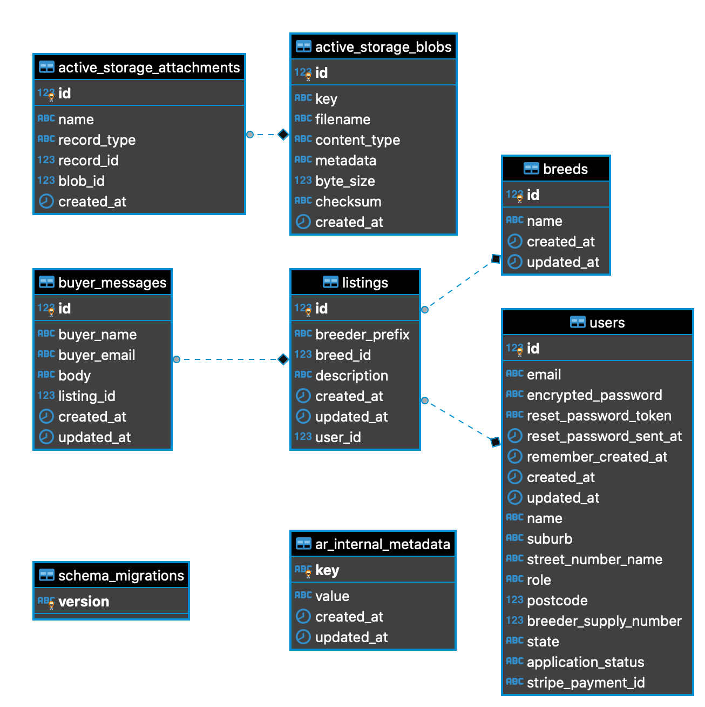 <br/>

This database schema is the implemented design of the application. All tables were been normalized by:

- adding user_id as a Foreign key to Listings table.
- adding breed_id as a Foreign key to Listings table.
- adding listing_id as a Foreign key to Buyer_Message table.

Database Relation: <br/>

- User Model has many Listings
- Breed Model has many Listings
- Listing Model belongs to Breed and User
- Listing Model has many Buyer::Messages
- Buyer::Message Model belongs to Listing

## Ways task were allocated and tracked

 <br/>
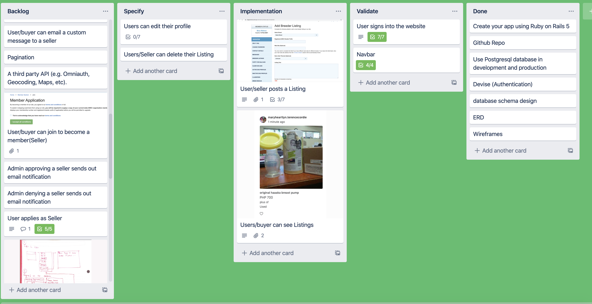 <br/>
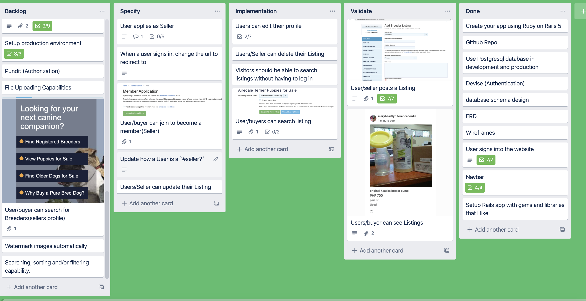 <br/>
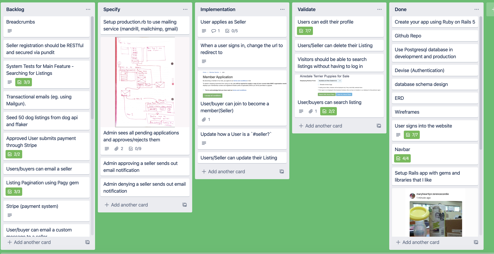 <br/>
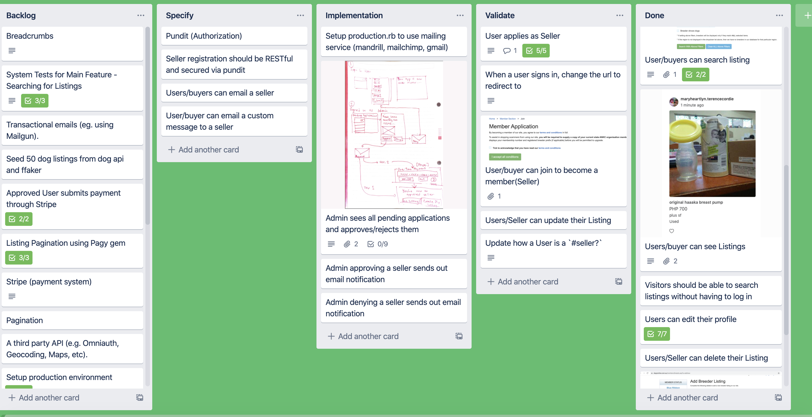 <br/>
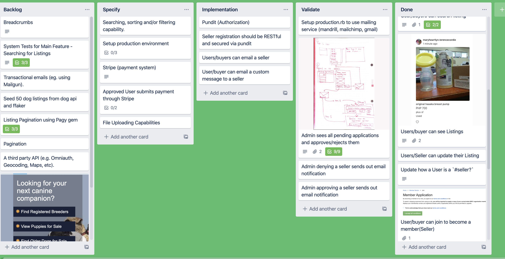 <br/>
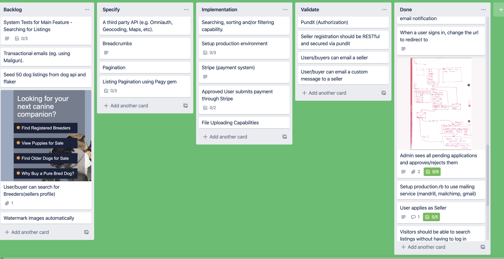 <br/>
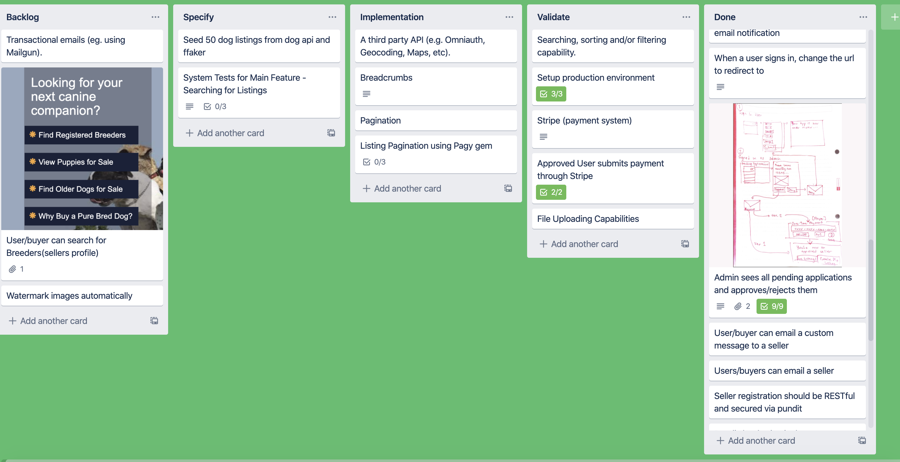 <br/>
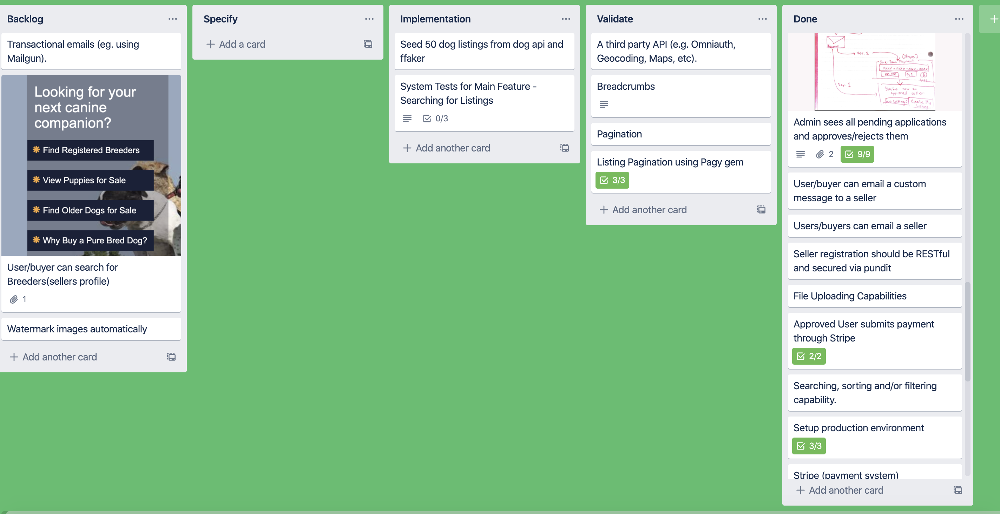 <br/>
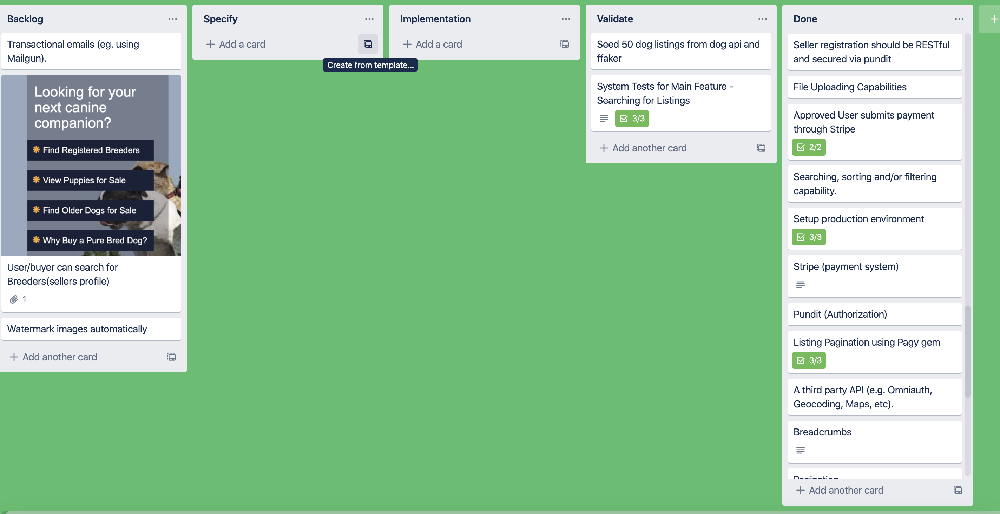 <br/>
